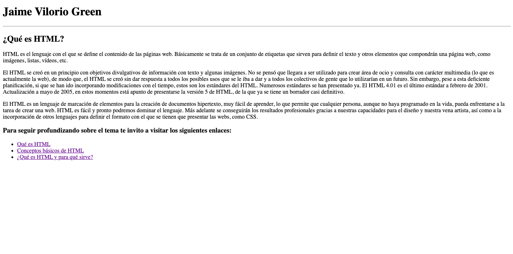

# Clases de HTML - INFOTEP

Este repositorio es para ir subiendo las actividades prácticas correspondiente al módulo de **HTML** del **Técnico en diseño de y creación de Software**.

### Observaciones
Las actividades estarán divididas en carpetas en la rama main.

### Actividades prácticas
- [Tarea 1](./tarea1/index.html)

